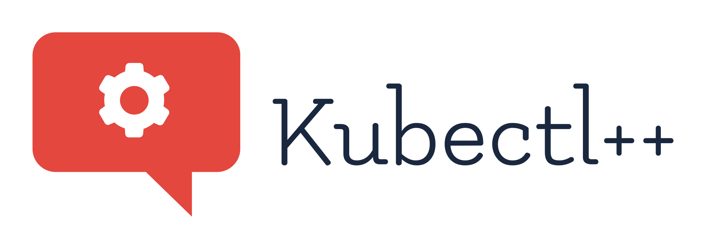
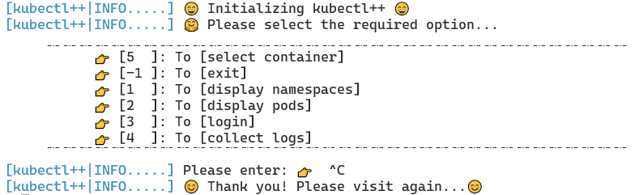

  

---

# Introduction

kubectl++ or kctl is advance interactive command line tool to display information of kubernetes first class objects.

# Docs

* Refer code documentation [here](https://shubham-gaur.github.io/kubectl-/)